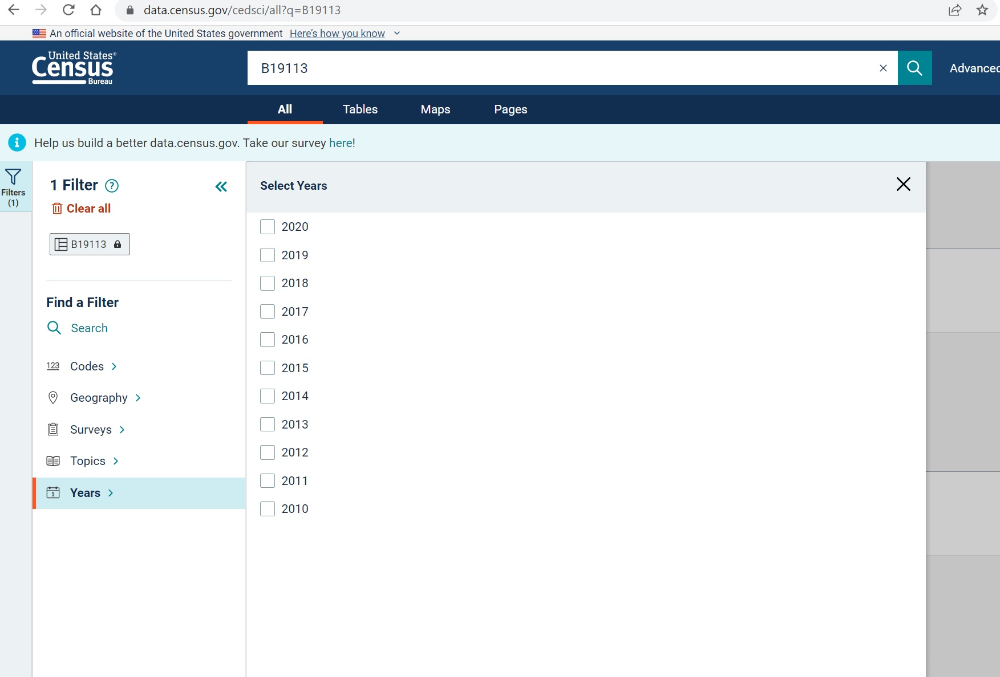

```{css, echo=FALSE}
.caption {
  font-size: 0.7rem;
  font-style: italic;
}
```

```{r setup, include=FALSE}
knitr::opts_chunk$set(echo = TRUE, results='hide', message=FALSE, warning=FALSE)
```

The Census Bureau provides data to the public in a number of ways, the most direct way being through [data.census.gov](data.census.gov). While data.census.gov has improved since its initial launch, it is still frustrating and lacking in its ability to browse and download data. As one example, it seems that as of April 2022 the American Community Survey (ACS) estimates from 2005-2009 are not available.



Fortunately, the Census Bureau also provides an API for more "sophisticated" users to query and download data. In this post, I share and demonstrate a simple function for downloading ACS data in R via the Census API. Note of course there are entire R packages that do this is as well, like [acs](https://cran.r-project.org/web/packages/acs/index.html) and [tidycensus](https://walker-data.com/tidycensus/). However, if I simply want to grab some data I find this simple function is sufficient.

```{r}
library(janitor)
library(jsonlite)
library(tidyverse)


get_ACS <- function(vars, geo, start_year, stop_year, vintage) {
  
  out_tibble <- tibble()
  
  years <- seq(from = start_year, to = stop_year)
  
  for (year in years) {
    query <- paste0("https://api.census.gov/data/",
                    year,
                    "/acs/acs",
                    vintage,
                    "?get=",
                    vars,
                    "&for=",
                    geo)
    myJSON <- fromJSON(query)
    myTibble <- as_tibble(myJSON, name_repail = "minimal")
    myTibble <- janitor::row_to_names(myTibble,1)
    myTibble <- myTibble %>% mutate(year = year)
    
    out_tibble <- rbind(out_tibble, myTibble)
  }
  
  return(out_tibble)
}
```

Having defined the function we can now use it! Let's get the estimate of Median Family Income in the United States (Table B19113^[For a list of these table codes, see [here](https://api.census.gov/data/2019/acs/acs5/groups.html)]) from 2005-2019.

```{r, results= 'markup'}
us_fam_income <- get_ACS("B19113_001E","us",2005,2019,1)
knitr::kable(us_fam_income)

```
Note that the estimate value is being stored as a character variable. The Census uses character codes like "*" to indicate missing or topcoded values. As is often the case, it is necessary to perform additional cleaning after retrieving the data.